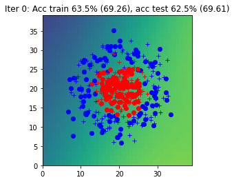
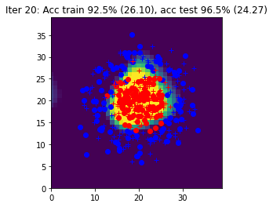
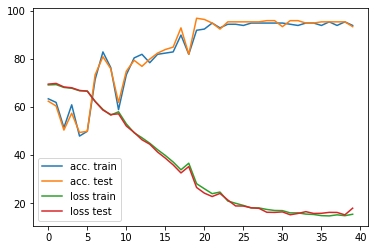
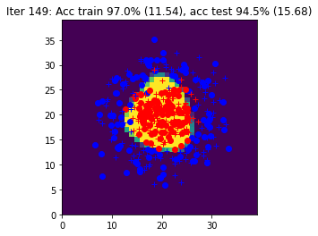
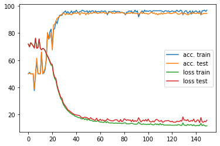
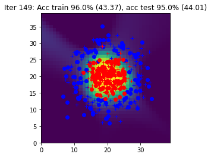
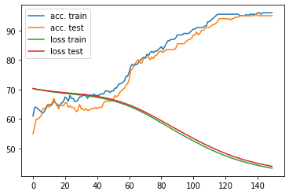
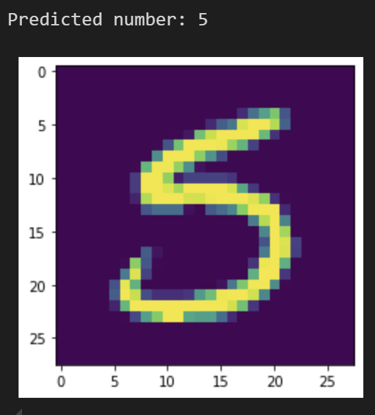
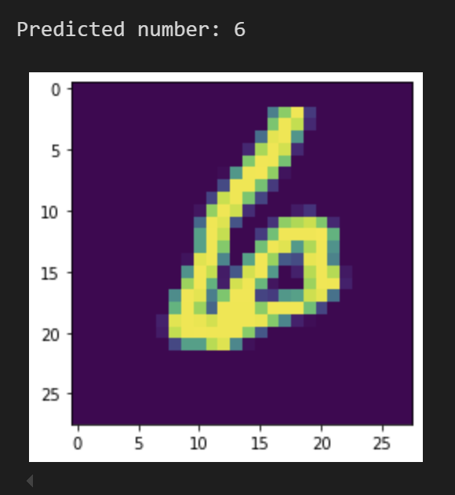

## Neural Netorks - first approach

The goal of this practical work is to build a simple neural network and to become familiar with these models
and how to train them with the backpropagation of the gradient.

To do this, we will begin by theoretically studying a perceptron with a hidden layer and its learning
procedure. We will then implement this network with the PyTorch library first on a toy problem to check
that it is working correctly, then on the MNIST dataset.
The site http://playground.tensorflow.org makes it possible to visualize the functioning and the
learning of small neural networks. 

### Manual Implementation
With a manual implementation of the backward and forward propagation we have the results: 

Arriving to an accuracy of 96.5%. 

### Backward pass with torch.autograd
Simplifying our code with the use of 
torch.autograd after 149 iterations we reach 
an accuracy level for the train data of 97% and 
tested 94.5%. 

### Forward pass with torch.nn
Completing the study with the use of torch.nn for the 
forward pass and global learning similar accuracy results 
are achieved. 

## Visualization with MNIST dataset
Having developed the NN, we trained it using part of 
the MNIST dataset containing images of handwritten digits. 
Then, feeding the testing images of the dataset, we obtained 
the classified digit from the network for each number. 

