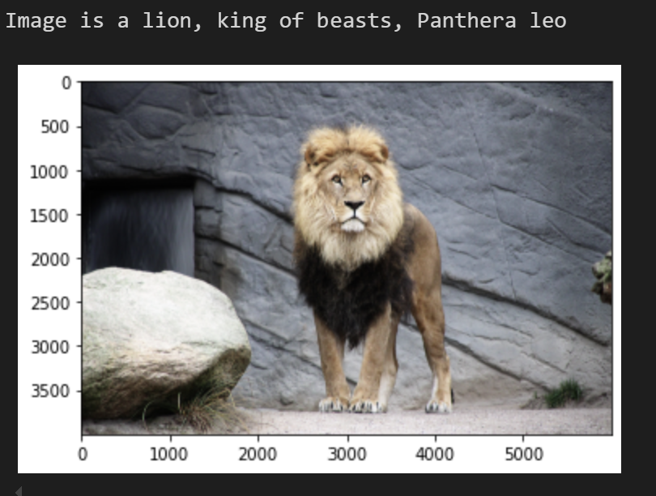
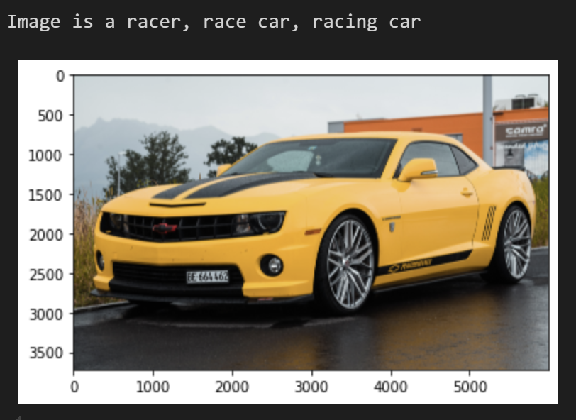

## Transfer Learning through feature extraction from a CNN

The goal of this first practical work is to overcome the over-fitting problem that we commonly encounter
when training our model on a subset that has not enough data.
Because of this the model would be too specialized on the training-set data and would not perform
well when using it on new data.
The idea that we want to implement to solve this problem is to train the model on a much larger set
of data from a bigger available data set similar to the one we are analysing.
This way the model will develop strong feature extraction tools that we can use to train the classification network.
Once we have developed the CNN, we can use it with our original dataset to have good results without
falling into over-fitting.

The CNN used is trained on the VGG16 dataset, a
dataset containing thousands of images classified in 
different classes (from racecars to animals). 

Results of the classification process, or rather, the 
association of key features to images, can be seen in 
these results: 

