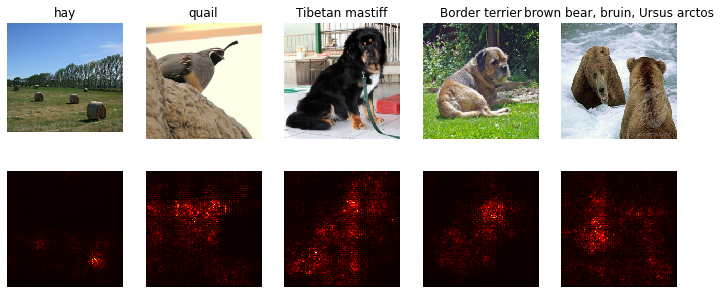
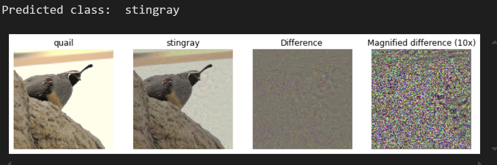

## Visualizing the CNN logic

The goal of this practical work is to study some techniques recently proposed to study the behavior
of CNNs, in order to better understand the reasoning behind the decisions made by the machine.
They all use the gradient of an input image with respect to an output class.

The most common visualization techniques are the saliency maps. 
A map that highlights the parts considered most interesting by a CNN to classify images. 

## Adversarial Examples (Fooling images)
It is possible to fool the classification CNN by simply 
adding some noise to an image. 

