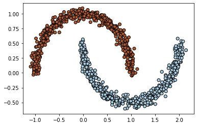
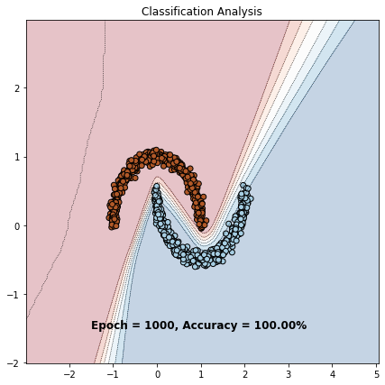

## Bayesian Regression Model

This second project work makes a step further the Bayesian Regression Model as the posterior and
predictive distributions are too simple to be applied to Neural Networks.
The first part of the project focuses on Bayesian Logistic Regression (BLR), the second Bayesian
Neural Networks.

For example, having two classigications distributed as 
follows: 

The classification using the BRM after 1000 epochs is 

